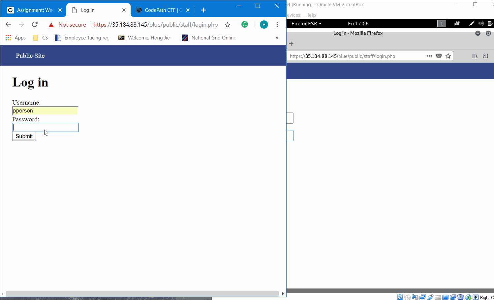
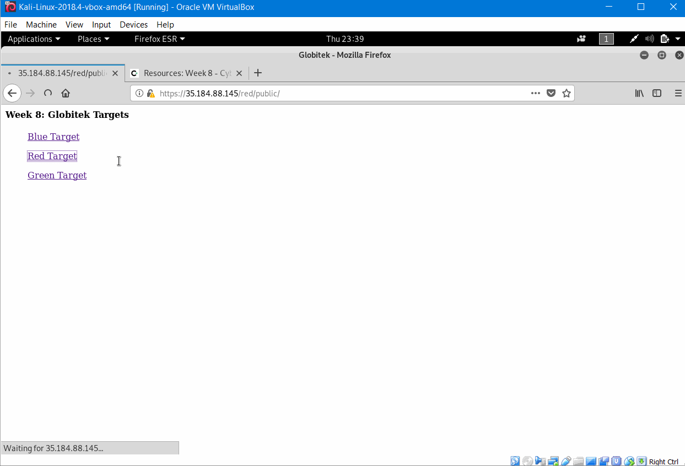

# Project 8 - Pentesting Live Targets

Time spent: **11** hours spent in total

> Objective: Identify vulnerabilities in three different versions of the Globitek website: blue, green, and red.

The six possible exploits are:
* Username Enumeration
* Insecure Direct Object Reference (IDOR)
* SQL Injection (SQLi)
* Cross-Site Scripting (XSS)
* Cross-Site Request Forgery (CSRF)
* Session Hijacking/Fixation

Each version of the site has been given two of the six vulnerabilities. (In other words, all six of the exploits should be assignable to one of the sites.)

## Blue

Vulnerability #1: SQL Injection

 * Steps: By clicking the Find a Salesperson section, we can notice from the URL that there is a id number associate with each Salesperson. So we can testify by the following ```?id=' OR 1=1'--``` and the blue target will show "Database query failed" while the other two targets just redirect the page. This indicates that the blue section has SQL Injection vulnerability.

 * GIF Walkthrough:
  


Vulnerability #2: Session Hijacking/Fixation


 * Steps: Login to the blue target, and change the ending URL to the given PHP script ```public/hacktools/change_session_id.php``` which gives the session id. Then we can open the other blue target without login in in the another browser. Change its url using the PHP script again, and set the session id to the previous session id, change the URL back, and we will find out that this blue target is also logined, which indicates that blue target has Session Hijacking/Fixation Vulnerability.

 * GIF Walkthrough: 
  

## Green

Vulnerability #1: Username Enumeration

 * Steps: When login with a username that not in the database, the alert message is in plain text, and inspect the message, we will see it says "failed". But when we try to login using a given username that is in the database, the alert message appeared is bold, and inspect the message tells us "failure". This tells the hacker that what user name is in the database,therefore,green target has Username Enumeration Vulnerability.

 * GIF Walkthrough:
 


Vulnerability #2: Cross-Site Scripting

 * Steps: In the green target's Contact Us section, enter the name and email, and in the Feedback section, we can put the following script```<script>alert('Hongjie found the XSS!')</script>``` ,submit it and in the login section, click the Feedback,since others are attacking these sites alongside us, the alert message created by others will pop up first and when their XSS are done, the alert message that I created will pop up, and the website tells the users that they are being hacked. This indicates the XSS Vulnerability of green target.

 * GIF Walkthrough:
   


## Red

Vulnerability #1: Insecure Direct Object Reference

 * Steps: In the Find a Salesperson section, click the showed salesperson, the URL have the format```https://35.184.234.47/red/public/salesperson.php?id=```, we can find people that not in the given list by setting the id to the IDs that not in the list.When I testify id=10 and id=11, the red target display the two salesperson that not in the list but the other two target sites will go back to the Find a Salesperson page. So the the red target has IDOR Vulnerability.

 * GIF Walkthrough:
  

Vulnerability #2: Cross-Site Request Forgery

 * Steps: Login to the target, and in the User section, edit the information like the Name, then change the value of csrd_token by inspecting the page, and click then click update. The red target allows us to make a change, while the other two targets show "Error: invalid request". Therefore, red target has CSRF Vulnerability.


 * GIF Walkthrough:
  

## Bonus Objective 2: Build on Objective #4 (Cross-Site Scripting)

 * Steps: Login to green target which has the XSS problem, in the Feedback of Contact Us section, put in the following ```<script>document.location="https://www.google.com"</script>```, then go to the feedback section in Login, it should direct the page to Google which is the site that I put. Additionally, if we type something like ``` <script>alert(document.cookie)</script>``` may read the cookie data and type ``` <script>document.cookie="username=John Smith"</script>```may set the cookie data to the information that we put.

 * GIF Walkthrough:
  


##Notes

